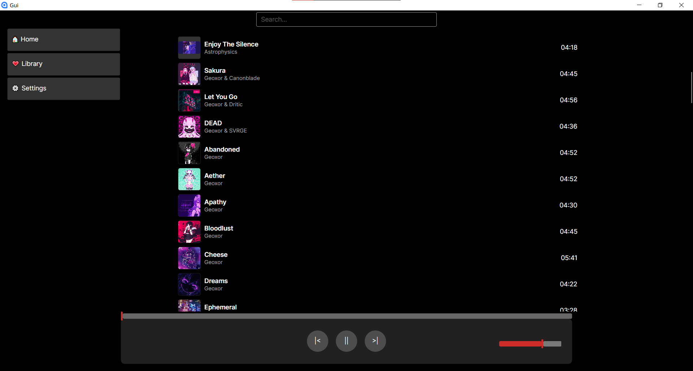

### Table of Contents
- [About](#about)
- [Installation](#installation)

---

### About
**Nexora** is a cross-platform, open source desktop audio player.

Target platforms currently are:
- Windows
- Linux
- MacOS (hasn't been tested yet, but it should work fine in theory, because all dependencies are platform-independent)



---

### Installation
The only option right now is to manually build the thing. You'll need:
- VLC
- .NET 10 SDK
- .NET 10 Runtime (optional)

<details>
<summary>Downloading dependencies</summary>
Arch Linux:

```
yay -S vlc
```

Windows:
```
winget install VideoLAN.VLC
```

---
</details>

<details>
<summary>Building the project</summary>
Clone the repository:

```
git clone "https://github.com/sapryx/nexora"
```

Build the project with:

```
dotnet publish -c Release
```

If you don't have .NET Runtime installed, you can add `--self-contained=true`, but it will make the build size bigger.

The executable file will be located at `Gui/bin/Release/net10.0/publish/`
</details>
